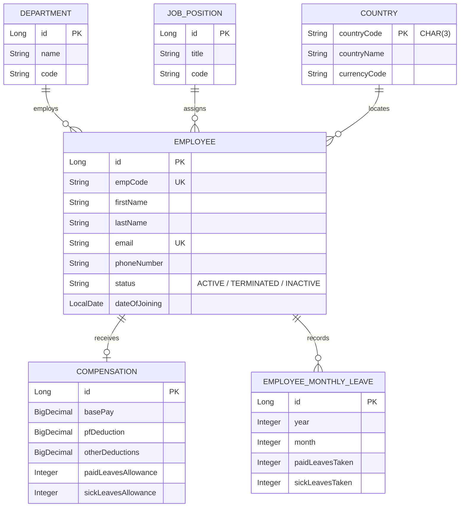
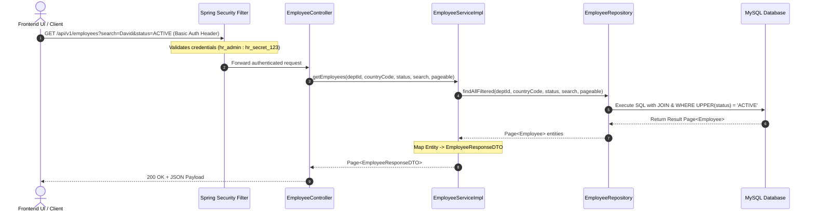
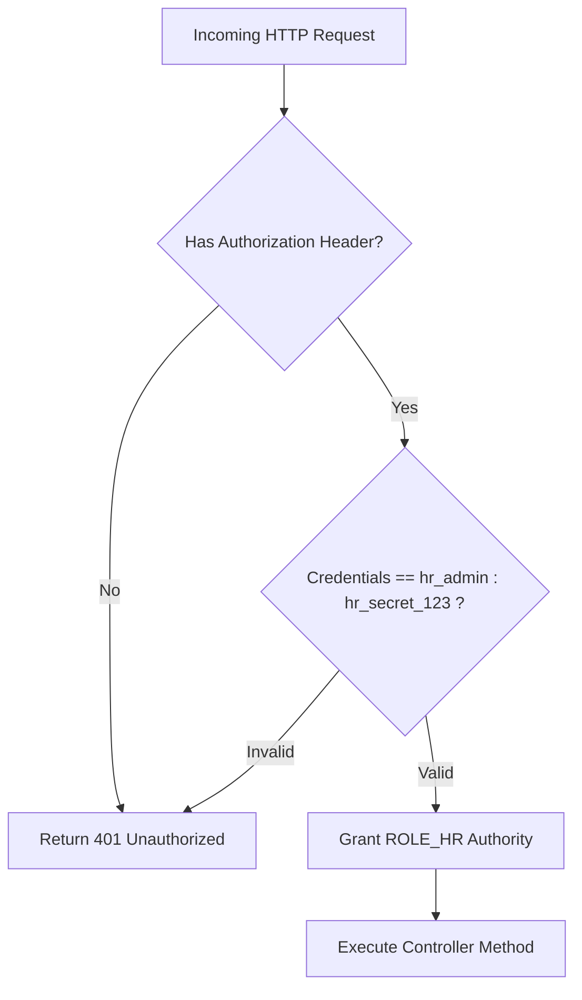

# ACME Salary Management Platform - Backend Architecture Guide

Welcome to the architectural specification for the **ACME Salary Management Backend**. This document provides an end-to-end breakdown of the backend system, explaining how business data moves from HTTP requests to database tables, how security guards every endpoint, and how 10,000+ employee records are processed with high performance.

> 💡 **For Non-Technical Readers**: Think of the backend as the **central administrative office** of a multinational bank. 
> - **Controllers** are the customer support desks that receive incoming mail (HTTP Requests) and hand out responses.
> - **Services** are the specialized departments (Payroll, HR, Analytics) that enforce rules and calculate salaries.
> - **Repositories** are the file room clerks who store and retrieve documents from the filing cabinet (the Database).
> - **Security** is the security guard standing at the front door checking badges before letting anyone in.

---

## 1. System Overview & Technology Stack

The backend is built using **Java 17 / Spring Boot 3**, leveraging enterprise-grade data persistence with **Spring Data JPA / Hibernate** and **MySQL 8**.

```
                           +----------------------------------+
                           |  REST API Client (Angular UI)   |
                           +----------------------------------+
                                            |
                                 HTTP Request + Basic Auth
                                            v
                           +----------------------------------+
                           |       Spring Security Filter     |
                           +----------------------------------+
                                            |
                                            v
                           +----------------------------------+
                           |       REST Controllers           |
                           | (Employee, Analytics, Seeder)    |
                           +----------------------------------+
                                            |
                                            v
                           +----------------------------------+
                           |       Service Layer (Impl)       |
                           | (Business Logic & Transactions)  |
                           +----------------------------------+
                                            |
                                            v
                           +----------------------------------+
                           |   Spring Data JPA Repositories   |
                           +----------------------------------+
                                            |
                                  SQL Queries / JDBC Batch
                                            v
                           +----------------------------------+
                           |         MySQL Database           |
                           +----------------------------------+
```

### Core Technologies
- **Framework**: Spring Boot 3.2.5 (Java 17+)
- **Security**: Spring Security 6 (HTTP Basic Authentication with `ROLE_HR`)
- **Database**: MySQL 8.0 (`acme_salary_db`)
- **ORM & Data**: Spring Data JPA, Hibernate 6
- **Testing**: JUnit 5, Mockito, Spring Security Test, Spring Boot Test (MockMvc)
- **Build Tool**: Apache Maven (`mvnw` wrapper)

---

## 2. Database Entities & Data Model

The domain model represents an enterprise organization operating across multiple countries with structured job positions and compensation breakdown.



### Key Domain Entities

1. **`Employee`**: Core worker entity. Contains demographic data, status (`ACTIVE`, `TERMINATED`), and references to `Department`, `JobPosition`, and `Country`.
2. **`Compensation`**: One-to-One linked entity storing exact monetary breakdown:
   $$\text{Total CTC} = \text{Base Pay} + \text{PF Deduction} + \text{Other Deductions}$$
3. **`Country`**: Uses 3-letter ISO codes (`USA`, `CAN`, `GBR`, `DEU`, `FRA`, `IND`, `AUS`, `JPN`, `SGP`, `BRA`) as primary key.
4. **`Department`**: Contains organization departments (Engineering, HR, Finance, Marketing, Sales).
5. **`JobPosition`**: Stores job titles and position tiers.
6. **`EmployeeMonthlyLeave`**: Tracks historical monthly leave consumption.

---

## 3. Data Transfer Objects (DTOs)

To maintain strict boundary separation between internal database tables and public API contracts, the system uses Java 17 immutable `record` DTOs.

| DTO Name | Direction | Purpose / Contents |
| :--- | :--- | :--- |
| `EmployeeRequestDTO` | Inbound (POST) | Used when creating a new employee with full compensation payload. |
| `EmployeeResponseDTO` | Outbound | Complete employee profile sent to UI including mapped compensation & department names. |
| `SalaryUpdateDTO` | Inbound (PUT) | Partial update payload for modifying base pay, deductions, leave allowances, and status. |
| `CountrySummaryDTO` | Outbound | Aggregated country analytics: `countryCode`, `countryName`, `headcount`, `averageBaseSalary`, `totalCtcSpend`. |
| `DepartmentSummaryDTO` | Outbound | Aggregated department analytics: `departmentId`, `departmentName`, `headcount`, `totalCtcSpend`. |
| `SalaryAnalyticsDTO` | Outbound | Top-level executive summary: `totalCompanyCost`, `globalAverageSalary`, `medianSalary`, `activeHeadcount`. |
| `TopEarnerDTO` | Outbound | Lightweight record for global and country top earner leaderboards. |

---

## 4. Layered Architecture & Request Flow

Every incoming HTTP request flows sequentially through distinct architectural layers:



### Component Roles

1. **Controllers (`com.example.salarymanagement.controller`)**:
   - `EmployeeController`: REST endpoints for employee search (`/api/v1/employees`), pagination, single fetch, creation, and salary updates.
   - `AnalyticsController`: REST endpoints for global summary (`/api/v1/analytics/summary`), country breakdown (`/breakdown/country`), department breakdown (`/breakdown/department`), and top earners (`/top-earners`).
   - `SeederController`: Trigger endpoint (`/api/v1/seed`) for high-volume data generation.

2. **Services (`com.example.salarymanagement.service.impl`)**:
   - `EmployeeServiceImpl`: Encapsulates validation (email/code uniqueness checks), entity transformations, and status updates.
   - `AnalyticsServiceImpl`: Computes active headcount, global total CTC, mean/median salary calculations, and regional breakdowns.
   - `SeederServiceImpl`: High-performance bulk database seeder generating 10,000 realistic employees with random normal distribution salaries across 10 regions using Hibernate batching (`entityManager.flush()` / `clear()`).

3. **Repositories (`com.example.salarymanagement.repository`)**:
   - Uses Spring Data JPA repositories with JPQL queries.
   - Filters active employees via `WHERE UPPER(e.status) = 'ACTIVE'` to exclude terminated employees from executive metrics.

---

## 5. Security Architecture

Security is implemented using **Spring Security 6** configured in `SecurityConfig.java`.



### Security Details
- **Authentication Scheme**: HTTP Basic Authentication.
- **Pre-Configured Administrative Account**:
  - **Username**: `hr_admin`
  - **Password**: `hr_secret_123`
  - **Role**: `ROLE_HR`
- **CORS Configuration**: Configured with `CorsConfiguration` permitting requests from Angular frontend (`http://localhost:4200`) with support for standard HTTP methods (`GET`, `POST`, `PUT`, `DELETE`, `OPTIONS`).
- **CSRF**: Disabled (`csrf.disable()`) for stateless REST API interactions.

---

## 6. Testing Strategy

The backend features automated unit and integration tests using **JUnit 5**, **Mockito**, and **Spring Security Test**:

1. **`EmployeeControllerTest`**: Tests REST endpoints using `MockMvc`, verifying 200 OK responses, JSON structure, HTTP Basic Auth challenge (401 Unauthorized when unauthenticated), and 404 Not Found error handling.
2. **`AnalyticsServiceTest`**: Validates summary statistics, mean salary computation, and median salary calculation algorithms.
3. **`EmployeeServiceTest`**: Tests business logic for employee filtering, creation validation, duplicate email checks, and compensation updates.

To execute the test suite:
```powershell
$env:JAVA_HOME = "C:\Users\ankit\.jdks\openjdk-19.0.2"
.\mvnw.cmd test
```

---

## 7. Performance & Optimization Highlights

- **Batch Seeding**: Configured with Hibernate batching (`spring.jpa.properties.hibernate.jdbc.batch_size=500`). The seeder inserts 10,000 employees and compensations in batches, clearing the persistence context after every batch to prevent memory leaks.
- **Indexed JPA Filtering**: Uses database indices on `emp_code`, `email`, `department_id`, and `country_code`.
- **Active Status Isolation**: Analytics queries explicitly scope queries to active personnel (`WHERE UPPER(e.status) = 'ACTIVE'`), delivering real-time compensation metrics without dead-weight calculations from historic terminated records.
